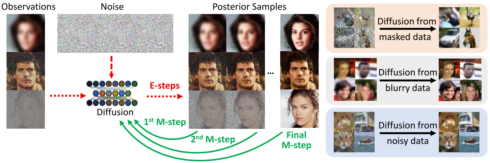

# An Expectation-Maximization Algorithm for Training Clean Diffusion Models from Corrupted Observations (NeurIPS 2024)

## Abstract
In this work, we propose EMDiffusion, an expectation-maximization (EM) approach to train diffusion models from corrupted observations. Our method alternates between reconstructing clean images from corrupted data using a known diffusion model (E-step) and refining diffusion model weights based on these reconstructions (M-step).
This iterative process leads the learned diffusion model to gradually converge to the true clean data distribution.on step, yielding more desirable generative path in noisy settings compared to the previous studies.



## Environment

Since the E-step is the same as [DPS](https://github.com/DPS2022/diffusion-posterior-sampling), so our required environment is the same as DPS, which is simple and easy to set.

The difference is that we adopt the Accelerate package for distributed training, you could easily install one that matches your machine. Or you can simply delete it in the code, then train diffusion with one GPU.

## Getting started

We perform E-steps and M-steps iteratively, specifically:

**Perform E-step:**

`bash e-step.sh`

**Perform M-step:**

`bash m-step.sh`

Please remember to change some hyperparameters defined in the two shell script that relate to the model path, dataset path or saving path, etc.


## Citation
If you find our work interesting, please consider citing

```
@inproceedings{
bai2024expectation,
title={An Expectation-Maximization Algorithm for Training Clean Diffusion Models from Corrupted Observations},
author={Weimin Bai and Yifei Wang and Wenzheng Chen and He Sun},
booktitle={The Eleventh International Conference on Learning Representations },
year={2024},
url={https://arxiv.org/abs/2407.01014}
}
```